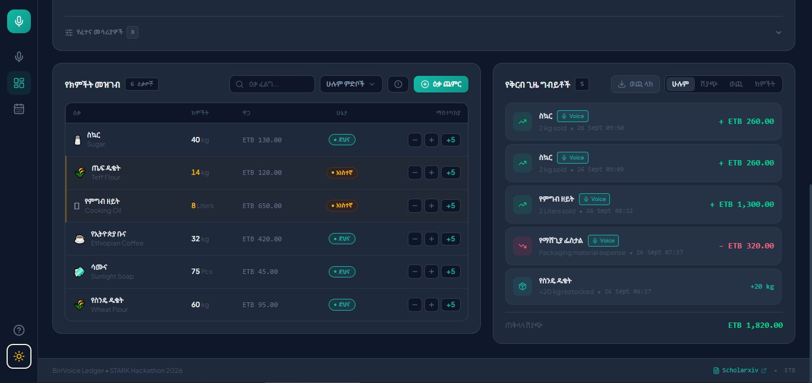
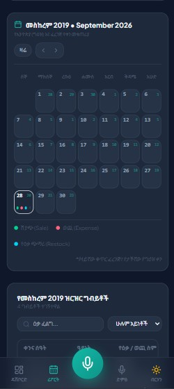
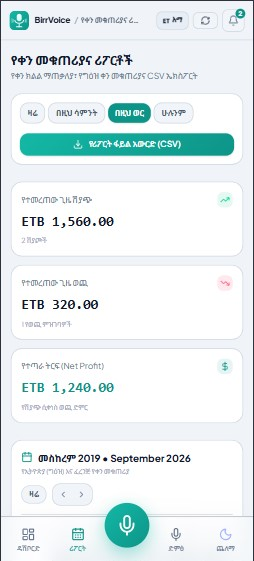

# BirrVoice Ledger | የኢትዮጵያ ንግድ ድምፅ ረዳት

### Voice-Powered Bookkeeping & Inventory Assistant for Ethiopian SMEs

<div align="center">

[](https://mihretu-dev.github.io/sme-voice-assistant/)
[](https://hackathon.stark.et/)
[](https://www.scholarxiv.com/write/6aa993bf67a18d2c6ed8ec92)

[](https://react.dev/)
[](https://tailwindcss.com/)
[](https://vitejs.dev/)
[](public/manifest.json)
[](LICENSE)

</div>

---

**BirrVoice Ledger** is a voice-first, bilingual bookkeeping and inventory assistant designed specifically for Ethiopian informal retailers, kiosk owners (_souqs_), market vendors, and small enterprise merchants.

Traditional accounting and POS applications require complex typing and menus that are impractical for merchants actively counting cash or measuring goods. BirrVoice Ledger solves this by enabling merchants to record daily sales, monitor stock, and track expenses completely hands-free via natural conversational speech in **Amharic (አማርኛ)** and **English**.

---

## 📸 Visual Showcase

### 1. Dashboard — Dark Mode (Desktop)

> Real-time sales, expenses, net cash metrics, inventory table and live transaction feed — all in one scrollable view with a sticky header.



---

### 2. Reports & Calendar — Desktop

> Dual Ethiopian (Ge'ez) + Gregorian calendar with activity dots, date-range KPI summaries, and 1-click CSV export.


---

### 3. Reports & Calendar — Mobile (Amharic)

> Fully responsive mobile layout with the centered floating mic button, Amharic calendar, and bottom navigation bar.



---

### 4. Transaction Ledger — Mobile

> Complete Amharic transaction history with date-range filtering and CSV export on a real phone.



---

## 📄 Ideation & Research (STARK Hackathon Rule 01)

- **Scholarxiv Ideation Paper**: [BirrVoice Ledger on Scholarxiv](https://www.scholarxiv.com/write/6aa993bf67a18d2c6ed8ec92)
- **Local Research Document**: [docs/IDEATION.md](docs/IDEATION.md)
- **Authors**: **Mihretu Hizkel** & **Hamerenoh Demelash** (_Team Pixel & Code_)
- **Core Hypothesis**: By eliminating keyboard and screen typing friction through voice-to-ledger streaming, informal merchants record over 90% of micro-transactions that are typically lost, reducing cash discrepancies and stockouts.

---

## 🌟 Key Features

### 🎙️ 1. Hands-Free Voice Logging (Powered by Voxide)

- **Large Central Mic Orb**: Prominent primary action — elevated dead-center in the mobile bottom nav (`w-16 h-16`) and prominent in the desktop sidebar. Visual states: `idle` (teal glow breathe), `listening` (red pulse + animated audio bars), `processing` (spinner), `success` (green check).
- **Real-Time Transcript Preview**: See your spoken words appear as text while speaking.
- **Natural Language Parsing**: Recognizes bilingual speech patterns in both English and Amharic Unicode:
  - _"5 ኪሎ ስኳር ተሸጠ 650 ብር"_ (Sold 5kg sugar for 650 ETB)
  - _"የፕላስቲክ ከረጢት ወጪ 300 ብር"_ (Plastic bags expense 300 ETB)
  - _"Restocked 20kg Wheat Flour"_
- **Structured JSON Intent Pipeline**: Automatically categorizes commands into `sale`, `expense`, or `stock` events.
- **Microphone Permission Flow**: Built-in permission handling with error states and simulation fallback.

### 📦 2. Ethiopian Inventory & Stock Tracking

- **Pre-Seeded Catalog**: Common Ethiopian retail commodities including Sugar (_ስኳር_), Teff Flour (_ጤፍ ዱቄት_), Cooking Oil (_የምግብ ዘይት_), Ethiopian Coffee (_የኢትዮጵያ ቡና_), and Soap (_ሳሙና_).
- **Stock Status Indicators**: Color-coded badges for _Normal_, _Low Stock_ (_አነስተኛ_), and _Out of Stock_ (_ያለቀ_).
- **Quick Adjustments**: Instant `+1`, `-1`, or `+5` batch inventory updates.
- **Add Product Modal**: Custom item creation with unit selection (kg, Liters, Pcs, Bags, Quintals).

### 💰 3. Financial Metrics & Transaction Ledger

- **Live Summary Cards**: Real-time calculated **Daily Sales**, **Daily Expenses**, and **Net Cash Margin**.
- **Audit Feed**: Complete transaction timeline with category filters (_All_, _Sales_, _Expenses_, _Restocks_).
- **CSV Ledger Export**: Single-click export for tax preparation, bank assessments, or bookkeeping.

### 📅 4. Dual Ethiopian & Gregorian Calendar

- **Interactive Calendar**: Click any day to filter the transaction table for that specific date.
- **Activity Dots**: Green (sales), Red (expenses), Cyan (restocks) on each calendar cell.
- **Ethiopian Ge'ez Calendar**: Each cell shows the corresponding Ethiopian day number alongside Gregorian.
- **Period Presets**: Today, This Week, This Month, All Time — one-click filter tabs.
- **Date-Range CSV Export**: Export ledger data for any selected date range.

### 🇪🇹 5. Full Localization & Ethiopian Cultural Integration

- **Complete Bilingual Support**: Every UI element — labels, buttons, modals, toasts, forms, tables, calendar — toggles between **English** and **አማርኛ (Amharic)** instantly.
- **Ethiopic Typography**: Styled with _Noto Sans Ethiopic_ and _Plus Jakarta Sans_.
- **Native Currency**: Consistent Ethiopian Birr (ETB / ብር) currency formatting everywhere.

### ⚡ 6. Production Ready & PWA Enabled

- **Progressive Web App (PWA)**: Installable directly to mobile home screens or desktop with `manifest.json` and offline `sw.js` service worker.
- **Rich Social Preview**: OpenGraph + Twitter Card meta tags with a branded 1200×630 preview card for social link sharing.
- **Branded Icon**: Custom teal-gradient SVG favicon with BirrVoice microphone icon.
- **Sticky Header**: The topbar stays fixed while content scrolls on all screen sizes.
- **Theme Toggle**: High-contrast Light and Dark modes with persistent `localStorage` preferences.
- **Demo Mode**: Load pre-populated Ethiopian product data with one click; reset to empty with another.
- **Bell Notifications**: Animated toasts (5-second auto-dismiss) + a notification history panel.
- **Keyboard-First Workflow**: Seamless hotkeys for busy checkout counters.

---

## ⌨️ Keyboard Shortcuts

|    Shortcut    | Description                                |
| :------------: | :----------------------------------------- |
|  <kbd>K</kbd>  | Activate / Stop voice microphone recording |
|  <kbd>N</kbd>  | Open "Add New Item" inventory modal        |
|  <kbd>D</kbd>  | Navigate to Dashboard summary view         |
|  <kbd>V</kbd>  | Navigate to Voice Logger view              |
|  <kbd>?</kbd>  | Open Help & Keyboard Shortcuts panel       |
| <kbd>Esc</kbd> | Close any active modal dialog              |

---

## 📱 Mobile Navigation

On small screens, a fixed **bottom navigation bar** replaces the sidebar:

|   Col 1   |  Col 2  |   Col 3    | Col 4 | Col 5 |
| :-------: | :-----: | :--------: | :---: | :---: |
| Dashboard | Reports | 🎙️ **MIC** | Voice | Theme |

The mic button is mathematically dead-center (column 3 of 5-column CSS grid) and elevated above the nav bar with a teal glow shadow.

---

## 📁 Project Architecture

```
sme-voice-assistant/
├── docs/
│   ├── IDEATION.md                     # Research paper & problem identification
│   └── screenshots/                    # Application UI screenshots
│       ├── inventory-ledger-dark.jpg   # Desktop dark mode dashboard
│       ├── calendar-desktop-dark.jpg   # Calendar reports desktop
│       ├── calendar-mobile.png         # Mobile calendar view
│       └── calendar-reports-mobile.png # Mobile transaction ledger
├── public/
│   ├── favicon.svg                     # Branded BirrVoice mic icon (SVG)
│   ├── app-icon.jpg                    # High-res app icon
│   ├── og-card.jpg                     # Social media rich preview card (1200x630)
│   ├── manifest.json                   # Web App Manifest
│   └── sw.js                           # Offline Service Worker
├── src/
│   ├── components/
│   │   ├── AddItemModal.jsx            # New commodity registration
│   │   ├── CalendarReports.jsx         # Dual Ethiopian/Gregorian calendar + CSV
│   │   ├── InventoryTable.jsx          # Stock management table
│   │   ├── NotificationToast.jsx       # Auto-dismiss animated status toasts
│   │   ├── OnboardingModal.jsx         # First-time merchant walk-through
│   │   ├── Sidebar.jsx                 # Nav sidebar + centered mobile mic button
│   │   ├── SummaryCards.jsx            # Real-time financial KPI cards
│   │   ├── Topbar.jsx                  # Sticky header: Language, Demo, Bell
│   │   ├── TransactionHistory.jsx      # Transaction ledger & CSV export
│   │   ├── VoiceLogger.jsx             # Mic orb, equalizer, and simulation chips
│   │   └── VoxideBridge.jsx            # Voxide speech API integration
│   ├── context/
│   │   ├── BusinessContext.jsx         # Global store for ledger & stock state
│   │   ├── ThemeContext.jsx            # Dark / light theme provider
│   │   └── VoiceContext.jsx            # Voice state & Voxide bridge
│   ├── utils/
│   │   └── formatters.js               # ETB currency & Ethiopian calendar formatters
│   ├── App.jsx                         # Master dashboard coordinator
│   ├── index.css                       # Custom teal brand tokens & animations
│   └── main.jsx                        # React application root
├── .env.example                        # Environment configuration template
├── index.html                          # HTML5 entrypoint with OG/Twitter meta tags
├── package.json
└── vite.config.js
```

---

## 🚀 Quick Start Guide

### Prerequisites

- [Node.js](https://nodejs.org/) (v18.0 or higher recommended)
- `npm` or `yarn`

### 1. Clone the Repository

```bash
git clone https://github.com/mihretu-dev/sme-voice-assistant.git
cd sme-voice-assistant
```

### 2. Install Dependencies

```bash
npm install
```

### 3. Environment Setup

Copy the example environment template and add your Voxide API credentials:

```bash
cp .env.example .env
```

Open `.env` and set:

```ini
VITE_VOXIDE_API_KEY=your_voxide_api_key_here
```

_(Note: If no API key is provided, the application runs in high-fidelity simulation mode with preset voice test chips and live natural language regex processing)._

### 4. Run Development Server

```bash
npm run dev
```

Open your browser and navigate to `http://localhost:5173`.

### 5. Build for Production

```bash
npm run build
```

Preview the production build:

```bash
npm run preview
```

---

## 🏆 STARK Hackathon 2026 Evaluation Checklist

- [x] **Rule 01 — Prove Your Ideation**: Fully cited [Scholarxiv Research Paper](https://www.scholarxiv.com/write/6aa993bf67a18d2c6ed8ec92) & [docs/IDEATION.md](docs/IDEATION.md).
- [x] **Voice AI Integration**: Streaming voice processing and conversational intent categorization via Voxide.
- [x] **Real-Time Transcript Preview**: Live text preview of voice commands while speaking.
- [x] **Local Relevance**: Designed specifically for Ethiopian informal retail commerce (ETB currency, Amharic language, Ethiopian Ge'ez calendar, staple commodity presets).
- [x] **Full Localization**: Every UI element available in both English and Amharic — including modals, toasts, tables, calendar, and forms.
- [x] **Offline & PWA Capability**: Installable progressive web application with service worker caching.
- [x] **Design & Ergonomics**: Polished dark/light UI, fully responsive layout for mobile + desktop, keyboard navigation, prominent centered mic button.
- [x] **Rich Social Preview**: OpenGraph & Twitter Card meta tags with branded preview card.

---

## 👥 Authors & Team

Developed with pride for the **STARK Hackathon 2026**:

- **Mihretu Hizkel** — Full-Stack Engineer & AI Integration
- **Hamerenoh Demelash** — UX / Product Design & Research

---

## 📜 License

This project is licensed under the [MIT License](LICENSE).
