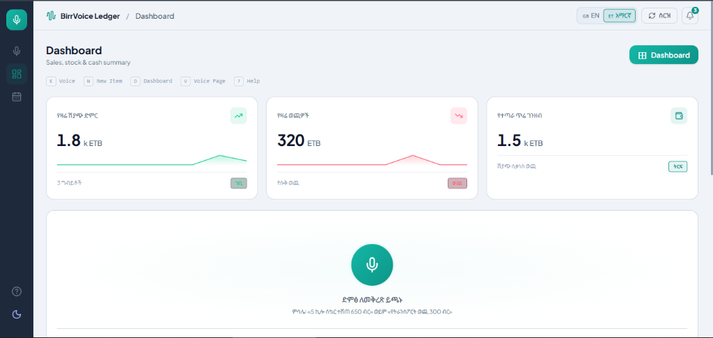
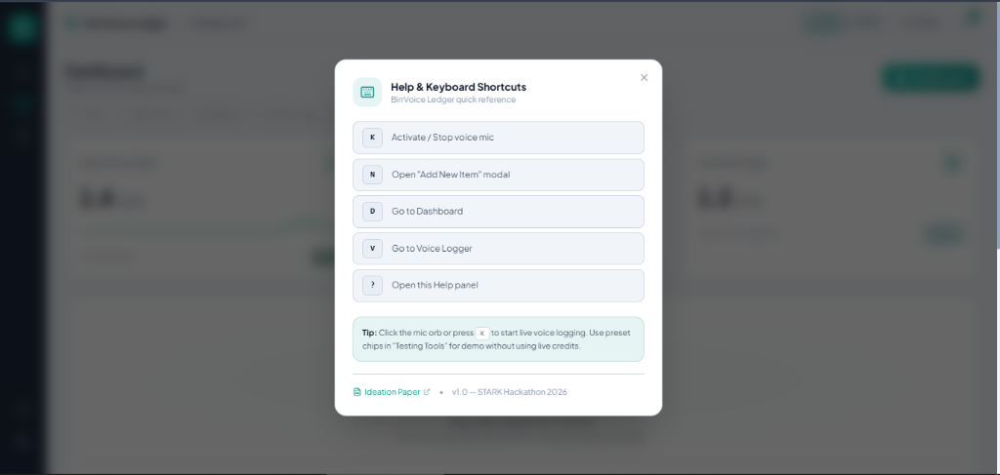

# BirrVoice Ledger | የኢትዮጵያ ንግድ ድምፅ ረዳት
### Voice-Powered Bookkeeping & Inventory Assistant for Ethiopian SMEs

[](https://hackathon.stark.et/)
[](https://www.scholarxiv.com/write/6aa993bf67a18d2c6ed8ec92)
[](https://react.dev/)
[](https://tailwindcss.com/)
[](https://vitejs.dev/)
[](public/manifest.json)

---

**BirrVoice Ledger** is a voice-first, bilingual bookkeeping and inventory assistant designed specifically for Ethiopian informal retailers, kiosk owners (*souqs*), market vendors, and small enterprise merchants. 

Traditional accounting and POS applications require complex typing and menus that are impractical for merchants actively counting cash or measuring goods. BirrVoice Ledger solves this by enabling merchants to record daily sales, monitor stock, and track expenses completely hands-free via natural conversational speech in **Amharic (አማርኛ)** and **English**.

---

## 📸 Visual Showcase

### 1. Light Mode Dashboard (Amharic Localization)
> Real-time sales, expenses, and net cash metrics, with the prominent teal voice orb and live action triggers.



---

### 2. Dark Mode Inventory & Transactional Ledger
> Categorized inventory catalog with instant stock indicators, quick adjustments, and audit-ready transaction history with 1-click CSV export.


---

### 3. Help & Keyboard Shortcuts
> Ergonomic hotkeys for rapid retail operation, permission diagnostics, and direct access to research documentation.



---

## 📄 Ideation & Research (STARK Hackathon Rule 01)

- **Scholarxiv Ideation Paper**: [BirrVoice Ledger on Scholarxiv](https://www.scholarxiv.com/write/6aa993bf67a18d2c6ed8ec92)
- **Local Research Document**: [docs/IDEATION.md](docs/IDEATION.md)
- **Authors**: **Mihretu Hizkel** & **Hamerenoh Demelash** (*Team Pixel & Code*)
- **Core Hypothesis**: By eliminating keyboard and screen typing friction through voice-to-ledger streaming, informal merchants record over 90% of micro-transactions that are typically lost, reducing cash discrepancies and stockouts.

---

## 🌟 Key Features

### 🎙️ 1. Hands-Free Voice Logging (Powered by Voxide)
- **Interactive Pulsing Orb**: Visual feedback states (`idle`, `listening`, `processing`, `success`, `error`) with animated equalizer waveform bars.
- **Natural Language Parsing**: Recognizes bilingual speech patterns in both English and Amharic Unicode:
  - *“5 ኪሎ ስኳር ተሸጠ 650 ብር”* (Sold 5kg sugar for 650 ETB)
  - *“የፕላስቲክ ከረጢት ወጪ 300 ብር”* (Plastic bags expense 300 ETB)
  - *“Restocked 20kg Wheat Flour”*
- **Structured JSON Intent Pipeline**: Automatically categorizes commands into `sale`, `expense`, or `stock` events.
- **Microphone Permission Diagnostics**: Built-in `MicPermissionModal` handles browser permissions, error states, and fallback simulation presets gracefully.

### 📦 2. Ethiopian Inventory & Stock Tracking
- **Pre-Seeded Catalog**: Common Ethiopian retail commodities including Sugar (*ስኳር*), Teff Flour (*ጤፍ ዱቄት*), Cooking Oil (*የምግብ ዘይት*), Ethiopian Coffee (*የኢትዮጵያ ቡና*), and Soap (*ሳሙና*).
- **Stock Status Indicators**: Color-coded badges for *Normal*, *Low Stock* (*አነስተኛ*), and *Out of Stock* (*ያለቀ*).
- **Quick Adjustments**: Instant `+1`, `-1`, or `+5` batch inventory updates with one click.
- **Add Product Modal**: Custom item creation with unit selection (kg, Liters, Pcs, Bags, Quintals).

### 💰 3. Financial Metrics & Transaction Ledger
- **Live Summary Cards**: Real-time calculated **Daily Sales**, **Daily Expenses**, and **Net Cash Margin** with sparkline trends.
- **Audit Feed**: Complete transaction timeline with category filters (*All*, *Sales*, *Expenses*, *Restocks*).
- **CSV Ledger Export**: Single-click export of transactions for tax preparation, bank loan assessments, or bookkeeping.

### 🇪🇹 4. Localization & Ethiopian Cultural Integration
- **Bilingual Support**: Instant toggle between **English** and **አማርኛ (Amharic)**.
- **Ethiopic Typography**: Styled with *Noto Sans Ethiopic* and *Plus Jakarta Sans*.
- **Ethiopian Ge'ez Calendar Support**: Includes date formatting for both the Ethiopian calendar (Meskerem, Tikimt, etc.) and Gregorian calendar.
- **Native Currency**: Consistent Ethiopian Birr (ETB / ብር) currency formatting.

### ⚡ 5. Production Ready & PWA Enabled
- **Progressive Web App (PWA)**: Installable directly to mobile home screens or desktop; includes `manifest.json` and offline `sw.js` service worker.
- **Theme Toggle**: High-contrast, accessibility-conscious Light and Dark modes with persistent user preferences in `localStorage`.
- **Keyboard-First Workflow**: Seamless hotkeys for busy checkout counters.

---

## ⌨️ Keyboard Shortcuts

| Shortcut | Description |
| :---: | :--- |
| <kbd>K</kbd> | Activate / Stop voice microphone recording |
| <kbd>N</kbd> | Open "Add New Item" inventory modal |
| <kbd>D</kbd> | Navigate to Dashboard summary view |
| <kbd>V</kbd> | Navigate to Voice Logger view |
| <kbd>?</kbd> | Open Help & Keyboard Shortcuts panel |
| <kbd>Esc</kbd> | Close any active modal dialog |

---

## 📁 Project Architecture

```
sme-voice-assistant/
├── docs/
│   ├── IDEATION.md               # Research paper & problem identification
│   └── screenshots/              # Application UI screenshots
│       ├── dashboard-light.png
│       ├── help-shortcuts.png
│       └── inventory-ledger-dark.png
├── public/
│   ├── favicon.svg               # App icon
│   ├── icon-192.png              # PWA mobile icon
│   ├── icon-512.png              # PWA splash icon
│   ├── manifest.json             # Web App Manifest
│   └── sw.js                     # Offline Service Worker
├── src/
│   ├── components/
│   │   ├── AddItemModal.jsx      # New commodity registration
│   │   ├── HelpModal.jsx         # Hotkeys & guide dialog
│   │   ├── InventoryTable.jsx    # Stock management table
│   │   ├── MicPermissionModal.jsx# Microphone error & permission handling
│   │   ├── NotificationToast.jsx # Auto-dismiss animated status toasts
│   │   ├── OnboardingModal.jsx   # First-time merchant walk-through
│   │   ├── Sidebar.jsx           # Clean navigation sidebar with dark mode toggle
│   │   ├── SummaryCards.jsx      # Real-time financial KPI cards
│   │   ├── Topbar.jsx            # Language, Demo/Reset, Notifications
│   │   ├── TransactionHistory.jsx# Transaction ledger & CSV export
│   │   └── VoiceLogger.jsx       # Mic orb, equalizer, and simulation chips
│   ├── context/
│   │   ├── BusinessContext.jsx   # Global store for ledger & stock state
│   │   └── ThemeContext.jsx      # Dark / light theme provider
│   ├── services/
│   │   └── voxideVoiceService.js # Voxide speech API integration & parser
│   ├── utils/
│   │   └── formatters.js         # ETB currency & Ethiopian calendar formatters
│   ├── App.jsx                   # Master dashboard coordinator
│   ├── index.css                 # Custom teal brand tokens & animations
│   └── main.jsx                  # React application root
├── .env.example                  # Environment configuration template
├── index.html                    # HTML5 entrypoint with Google Fonts
├── package.json
└── vite.config.js
```

---

## 🚀 Quick Start Guide

### Prerequisites
- [Node.js](https://nodejs.org/) (v18.0 or higher recommended)
- `npm` or `yarn`

### 1. Clone the Repository
```bash
git clone https://github.com/mihretu-dev/sme-voice-assistant.git
cd sme-voice-assistant
```

### 2. Install Dependencies
```bash
npm install
```

### 3. Environment Setup
Copy the example environment template and add your Voxide API credentials:
```bash
cp .env.example .env
```
Open `.env` and set:
```ini
VITE_VOXIDE_API_KEY=your_voxide_api_key_here
```
*(Note: If no API key is provided, the application runs in high-fidelity simulation mode with preset voice test chips and live natural language regex processing).*

### 4. Run Development Server
```bash
npm run dev
```
Open your browser and navigate to `http://localhost:5173`.

### 5. Build for Production
```bash
npm run build
```
Preview the production build:
```bash
npm run preview
```

---

## 🏆 STARK Hackathon 2026 Evaluation Checklist

- [x] **Rule 01 — Prove Your Ideation**: Fully cited [Scholarxiv Research Paper](https://www.scholarxiv.com/write/6aa993bf67a18d2c6ed8ec92) & [docs/IDEATION.md](docs/IDEATION.md).
- [x] **Voice AI Integration**: Streaming voice processing and conversational intent categorization.
- [x] **Local Relevance**: Designed specifically for Ethiopian informal retail commerce (ETB currency, Amharic language, Ethiopian calendar, staple commodity presets).
- [x] **Offline & PWA Capability**: Installable progressive web application with service worker caching.
- [x] **Design & Ergonomics**: Polished dark/light UI, responsive layout, and full keyboard navigation.

---

## 👥 Authors & Team

Developed with pride for the **STARK Hackathon 2026**:
- **Mihretu Hizkel** — Full-Stack Engineer & AI Integration
- **Hamerenoh Demelash** — UX / Product Design & Research

---

## 📜 License

This project is licensed under the [MIT License](LICENSE).
